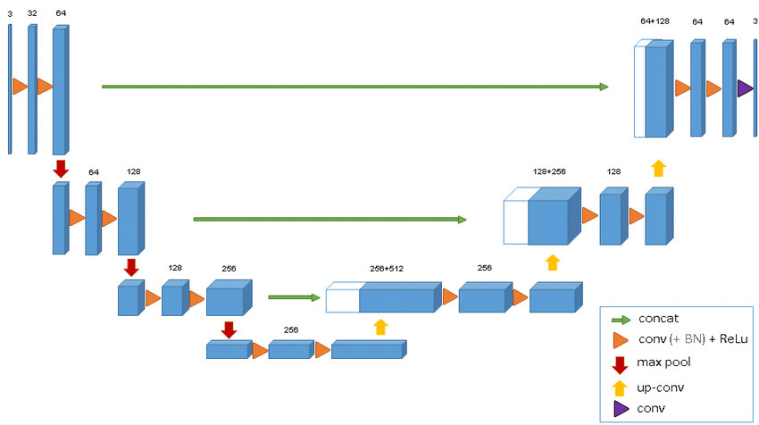
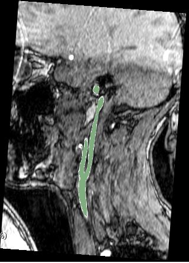
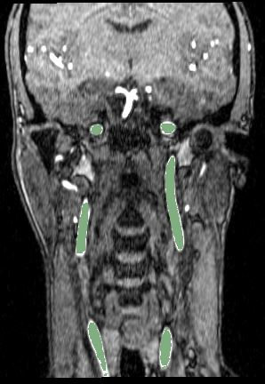
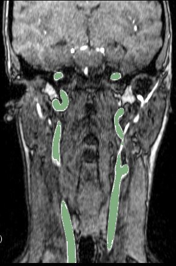

# 3D-Unet: patched based 3D U-net for medical images segmentation

3D-Unet pipeline is a computational toolbox (python-Keras) for segmentation using neural networks. 

The training and the inference are patch based: the script randomly extract corresponding patches of the images and labels and feed them to the network during training.
The inference script extract, segment the sigle patches and automatically recontruct them in the original size.

# Examples

Sample MR images from the sagittal and coronal views for carotid artery segmentation (the segmentation result is highlighted in green)

*******************************************************************************

# Requirements
- Python 
- pillow
- scikit-learn
- simpleITK
- keras
- scikit-image
- pandas
- pydicom
- nibabel
- tqdm
- git+https://www.github.com/farizrahman4u/keras-contrib.git

# Python scripts and their function

- generator.py / NiftiDataset.py : They augment the data, extract the patches and feed them to the GAN. NiftiDataset.py
  skeleton taken from https://github.com/jackyko1991/vnet-tensorflow

- check_loader_patches: Shows example of patches fed to the network during the training  

- unet3d.py: the architecture of the U-net. Taken from https://github.com/ellisdg/3DUnetCNN

- main.py: Runs the training and the prediction on the training and validation dataset.

- predict.py: It launches the inference on training and validation data in the main.py

- segment_single_image.py: It launches the inference on a single input image chosen by the user.

