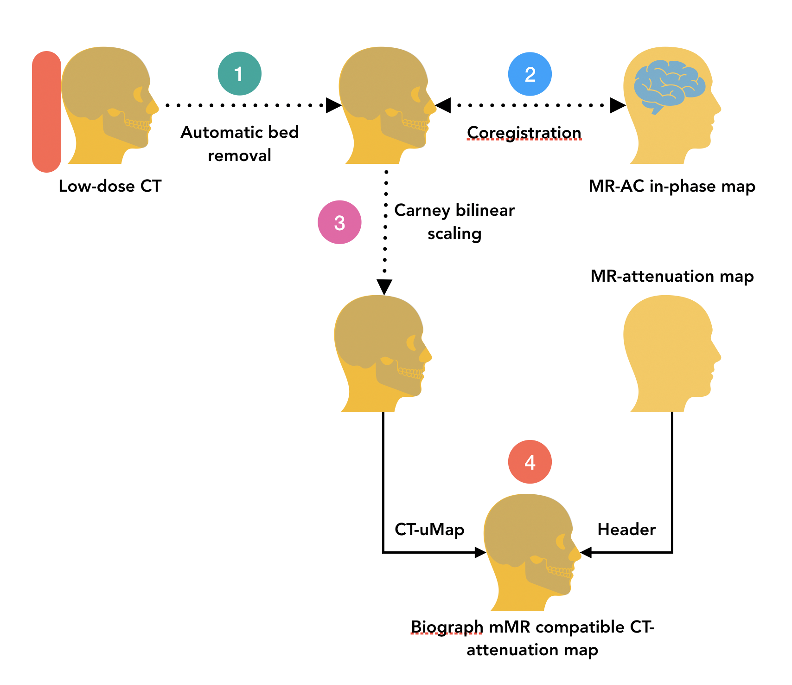

# COCOA: COnverting low-dose CT images tO MR Attenuation maps.

This program converts low-dose CT images (from Siemens mCT) to CT attenuation maps using carney bilinear scaling. Subsequently, it replaces the sub-optimal MR-attenuation maps with the calculated CT-attenuation maps while retaining the original MR attenuation map headers. This is crucial for performing offline PET reconstructions using the data from the Siemens PET/MR.

# Workflow

