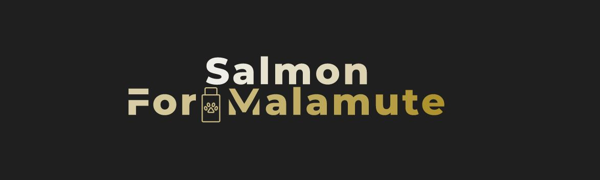
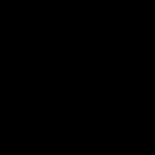

# SALMON v.2: Segmentation deep learning ALgorithm based on MONai toolbox
- SALMON is a computational toolbox for segmentation using neural networks (3D patches-based segmentation)
- SALMON is based on MONAI 0.7.0 : PyTorch-based, open-source frameworks for deep learning in healthcare imaging. 
(https://github.com/Project-MONAI/MONAI)
(https://github.com/MIC-DKFZ/nnUNet)
(https://arxiv.org/abs/2103.10504)

This is my "open-box" version if I want to modify the parameters for some particular task, while the two above are hard-coded. The monai 0.5.0 folder contains the previous versions based on the old monai version.

*******************************************************************************
## Requirements
Follow the steps in "installation_commands.txt". Installation via Anaconda and creation of a virtual env to download the python libraries and pytorch/cuda.
*******************************************************************************
## Python scripts and their function

- organize_folder_structure.py: Organize the data in the folder structure (training,validation,testing) for the network. 
Labels are resampled and resized to the corresponding image, to avoid array size conflicts. You can set here a new image resolution for the dataset. 

- init.py: List of options used to train the network. 

- check_loader_patches: Shows example of patches fed to the network during the training.  

- networks.py: The architectures available for segmentation 

- train.py: Runs the training

- predict_single_image.py: It launches the inference on a single input image chosen by the user.
*******************************************************************************
## Usage

Sample images: the following images show the segmentation of carotid artery from MRI sequence



*******************************************************************************
### Inference:
- Launch "predict_single_image.py" to test the network. Modify the parameters in the parse section to select the path of the weights, images to infer and result. 

### Sample script inference
- The label can be omitted (None) if you segment an unknown image. You have to add the --resolution if you resampled the data during training (look at the argsparse in the code).
```console
python predict_single_image.py --image 'image0.nii' --label 'label.nii' --result 'result0.nii' --weights './best_metric_model.pth'
```
*******************************************************************************
