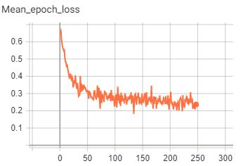
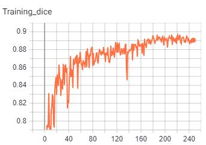
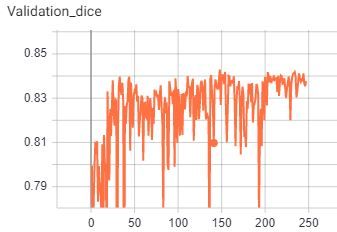
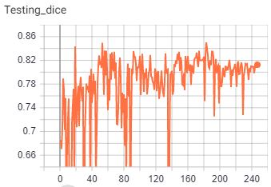

# SALMON for MALAMUTE
*******************************************************************************
## Requirements
See requirements.txt list. We use "nvcr.io/nvidia/pytorch:19.03-py3" docker and we install all the requirements with:
"pip install -r requirements.txt"
*******************************************************************************
## Weights for segmentation
Temporary best weights can be downloaded at the link:
https://drive.google.com/file/d/1utti9-3yOVo4xmhLNnfgM3yYSPNTEAoA/view?usp=sharing

- Training data (14 images): 0.88 dice score
- Validation data (3 images): 0.842 dice score
- Testing data (1 image): 0.82 dice score

Images, labels and temporary results are available (with authorization) at https://drive.google.com/file/d/1mwALphu7WDqsBz2vlxg1cam53RwSH5Y7/view?usp=sharing
*******************************************************************************

## Python scripts and their function

- organize_folder_structure.py: Organize the data in the folder structure for the network

- init.py: List of options used to train the network. 

- check_loader_patches: Shows example of patches fed to the network during the training  

- networks.py: The architectures available for segmentation.

- train.py: Runs the training

- predict_single_image.py: It launches the inference on a single input image chosen by the user.
*******************************************************************************
## Usage
### Folders structure:
Use first "organize_folder_structure.py" to create organize the data in the following folder structure:


	.
	├── Data_folder                   
	|   ├── train              
	|   |   ├── images             # Training data
	|   |   |   ├── image1.nii              
	|   |   |   └── image2.nii                     
	|   |   └── labels             
	|   |   |   ├── label1.nii              
	|   |   |   └── label2.nii              
	|   ├── val               
	|   |   ├── images             # Validation data
	|   |   |   ├── image3.nii              
	|   |   |   └── image4.nii              
	|   |   └── labels             
	|   |   |   ├── label3.nii              
	|   |   |   └── label4.nii
	|   ├── test               
	|   |   ├── images             # Testing data
	|   |   |   ├── image5.nii              
	|   |   |   └── image6.nii              
	|   |   └── labels             
	|   |   |   ├── label5.nii              
	|   |   |   └── label6.nii  
*******************************************************************************
### Training:
Modify the "init.py" to set the parameters and start the training/testing on the data.
Afterwards launch the train.py for training. Tensorboard is available to monitor the training:	



Sample images: on the left side the image, in the middle the result of the segmentation and on the right side the true label
The following images show the segmentation of carotid artery from MR sequence


*******************************************************************************
### Inference:
Launch "predict_single_image.py" to test the network. Modify the parameters in the parse section to select the path of the weights, images to infer and result. 
*******************************************************************************
### Tips:
Use and modify "check_loader_patches.py" to check the patches fed during training. 
Use and modify "networks.py" to modify the network and check the number of parameters. 


### Sample script inference
```console
python predict_single_image.py --image './Data_folder/images/train/image13.nii' --label './Data_folder/labels/train/label13.nii' --result './Data_folder/results/train/prova.nii' --weights './best_metric_model.pth'
```
*******************************************************************************
### Future Development: TO DO list

- Add more networks structures in networks.py
- Implement it for multilabel segmentation in the same script. (call multilabel losses)
