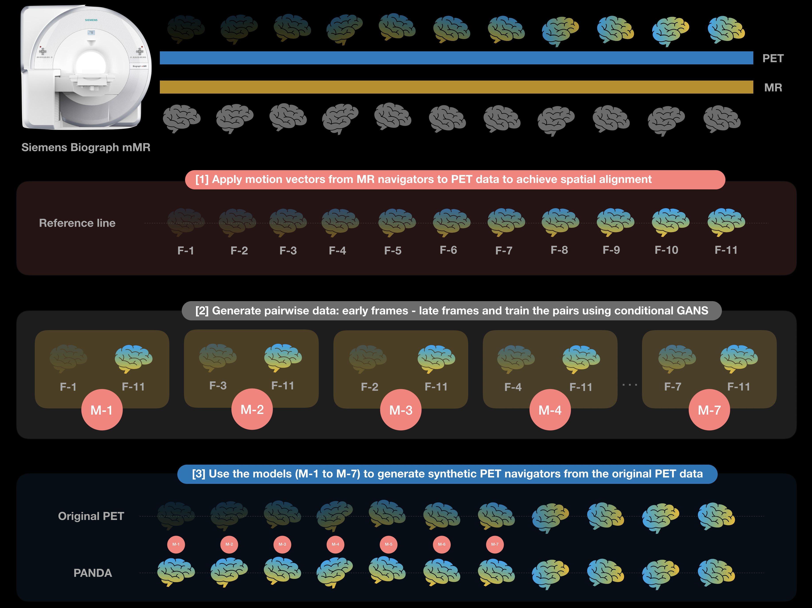

# PANDA: PET nAvigators usiNg Deep leArning

PANDA pipeline, is a computational toolbox (MATLAB + python) for generating PET navigators using Generative Adversarial networks. 

# Workflow



# Important note

For the conditional GANs to work, the frames should have a minimal amount of activity distribution to start with. This can be evaluated with the aid of the two functions below. 

  [1] generate_gradient_images.m : generates a 3D gradient images for each PET frame.
  [2] shannon_entropy_fingerprinting.ipynb : calculates the a shannon-entropy fingerprint for each image volume, and identifies the frames that can be used for PANDA training. 
      [-]

# Examples

Sample images (axial and coronal views): on the left side are the early PET frames, in the middle the output of the 3D GAN and on the right side the corresponding late PET frame


*******************************************************************************

*******************************************************************************
# Requirements

- MATLAB R2016a or higher
- SPM 12
- Python 3

# MATLAB scripts and their function 

- checkFileFormat.m : Checks the format of the medical images in a given folder, the output is a string which says if the folder contains 'Dicom', 'Nifti' or 'Analyze'.

- convertDicomtoNii.m: Converts the Dicom series in a folder to nifti files, using SPM.

# Python scripts and their function

- data_generator.py / NiftiDataset.py : They normalize, augment the data, extract the patches and feed them to the 3DGAN. 

- check_loader_patches: Shows paired early and late frames patches fed to the 3DGANGan during the training  

- generator.py / discriminator.py / DCGAN.py: the architecture of the 3DGAN.

- main.py: Runs the training and the inference on the training and validation dataset.

- logger.py: Generates sample images and histograms to monitor the training (called by the main.py).

- predict.py: It launches the inference on training and validation data (called by the main.py).

- predict_single_image.py: It launches the inference on a single input image chosen by the user (not called by the main.py).

# Tutorial for 3DGAN

1) Launch the matlab file "convertDicomtoNii.m" to convert Dicom in Nifti format. All images in this study are produced with a PET/MRI-Siemens Biograph mMR. Frames dimensions are 344x344x127. 

2) Place early-frames in "Data_folder/volumes" folder and late-frames in "Data_folder/labels" folder. Be sure that early/late frames are correctly paired in the two folders.

3) Launch the pipeline for training and testing dataset (example): 
```console
python3 main.py --Create_training_test_dataset=True --Do_you_wanna_train=True  --Do_you_wanna_check_accuracy=True --patch_size=(128,128,64)
```
Sample of the logger, which helps to monitor the training process


4) Launch the inference on only one image (example):

```console
python3 predict_single_image.py --image "path to early frame" --result "path where to save the late frame" --gen_weights "path to the weights of the generator network to load"  --patch_size=(128,128,64)
```
### Sample script inference
```console
C:\Users\David\Desktop\3D GAN>python predict_single_image.py --image C:\Users\David\Desktop\test_image.nii --result C:\Users\David\Desktop\result.nii --gen_weights C:\Users\David\Desktop\weights.h5
```


There are several parameters you can set; you can modify the default ones in the script or write them manually in the pipeline. The description for each one is in the main.py file

## Citations

To implement PANDA we were inspired by existing codes from other github contributors. Here is the list of github repositories:

- https://github.com/jackyko1991/vnet-tensorflow

- https://github.com/joellliu/3D-GAN-for-MRI


