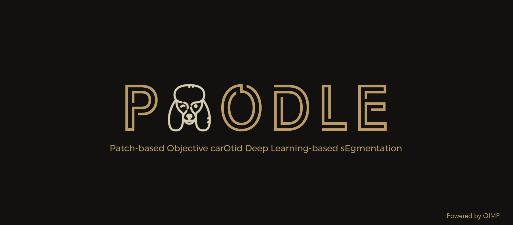
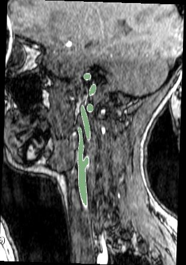

# POODLE: Patch-based Objective carOtid Deep Learning-based sEgmentation

3D-Unet pipeline is a computational toolbox for segmentation using neural networks. 

The training and the inference are patch based: the script randomly extract corresponding patches of the images and labels and feed them to the network during training.
The inference script extract, segment the sigle patches and automatically recontruct them in the original size.
*******************************************************************************
### Pre-trained-model
The weights are available and you can download them from the following link: https://drive.google.com/file/d/1iu3q4h5z8Hvc9tOiUV4bZwotPoDEc6Gb/view?usp=sharing
*******************************************************************************
### Example images
Sample MR images from the sagittal and coronal views for carotid artery segmentation (the segmentation result is highlighted in green)

*******************************************************************************

### Requirements
See requirements.txt list

### Python scripts and their function

- organize_folder_structure.py: Organize the data in the folder structure for the network

- NiftiDataset.py : They augment the data, extract the patches and feed them to the GAN (reads .nii files). NiftiDataset.py
  skeleton taken from https://github.com/jackyko1991/unet3d-pytorch

- check_loader_patches: Shows example of patches fed to the network during the training  

- UNet.py: the architecture of the U-net.

- utils.py : list of metrics and loss functions for the training

- main.py: Runs the training and the prediction on the training and validation dataset.

- predict.py: It launches the inference on training and validation data in the main.py

- predict_single_image.py: It launches the inference on a single input image chosen by the user.

## Usage
Modify the init.py to set the parameters and start the training/testing on the data:
Folder Structure:

	.
	├── Data_folder                   
	|   ├── train_set              
	|   |   ├── patient_1             # Training
	|   |   |   ├── image.nii              
	|   |   |   └── label.nii                     
	|   |   └── patient_2             
	|   |   |   ├── image.nii              
	|   |   |   └── label.nii              
	|   ├── test_set               
	|   |   ├── patient_3             # Testing
	|   |   |   ├── image.nii              
	|   |   |   └── label.nii              
	|   |   └── patient_4             
	|   |   |   ├── image.nii              
	|   |   |   └── label.nii              
	|   ├── validation_set               
	|   |   ├── patient_5            # Validation
	|   |   |   ├── image.nii             
	|   |   |   └── label.nii              
	|   |   └── patient_6             
	|   |   |   ├── image.nii              
	|   |   |   └── label.nii                  

## Features
- 3D data processing ready
- Augmented patching technique, requires less image input for training
- one channel output (multichannel to be developed)
- Generic image reader with SimpleITK support
- Medical image pre-post processing with SimpleITK filters
- Easy network replacement structure
- Dice score similarity measurement as golden standard in medical image segmentation benchmarking

