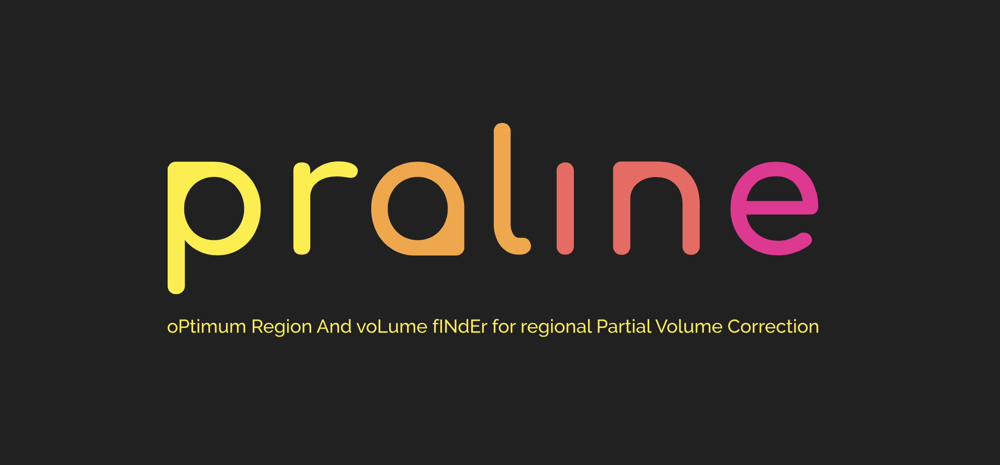

# Praline PVC
PRALINE-PVC is a MATLAB based software, for identifying the optimum region and volume for performing regional partial volume correction in order to calculate an accurate image-derived input function. The program scouts for homogenous regions around the entire internal carotid artery to identify 'optimum' regions for applying the activity balance algorithm (refer literature)
