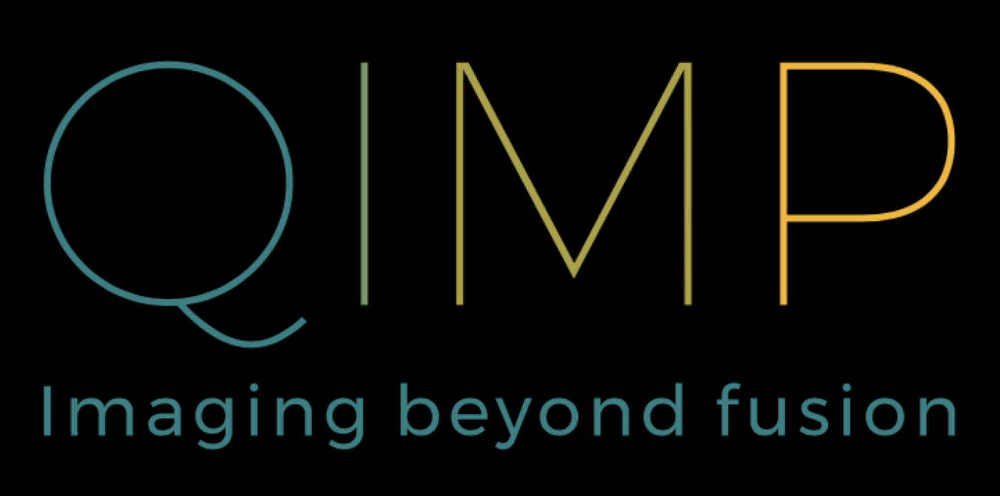

# QIMP-tools
This repository contains software tools (for Siemens mMR and mCT) developed/adopted by the Quantitative Imaging and Medical Physics (QIMP) team, Medical University of Vienna. The tools can be modified to other systems as well :)
